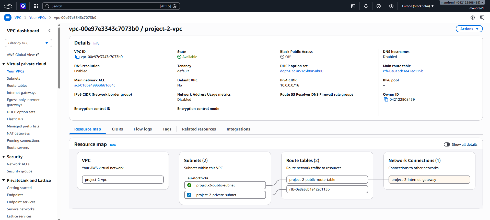
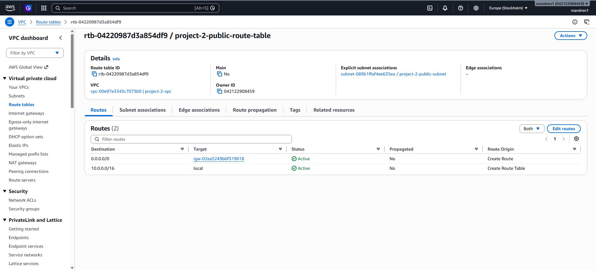
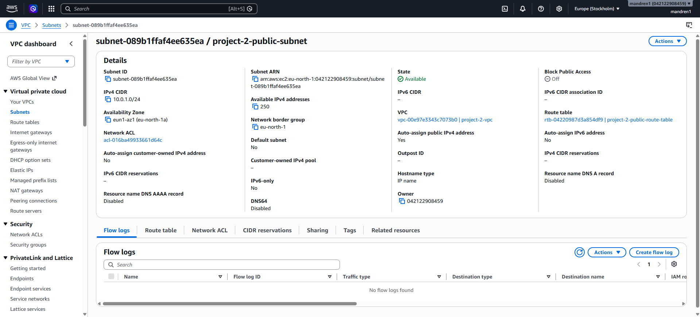
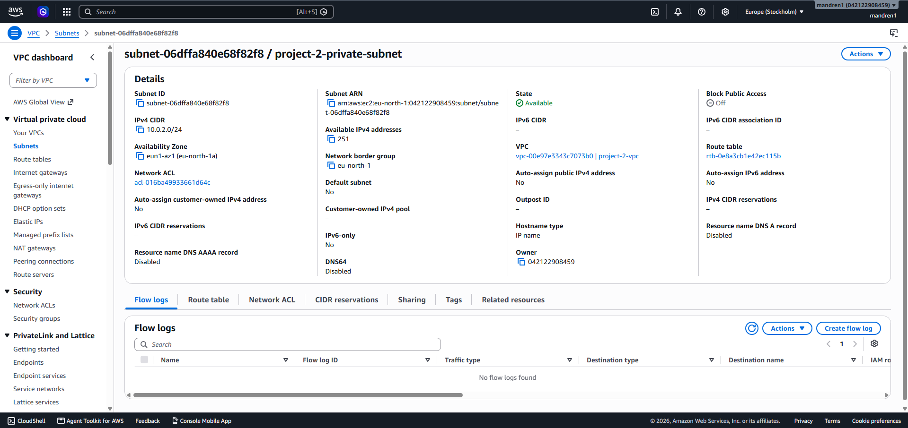
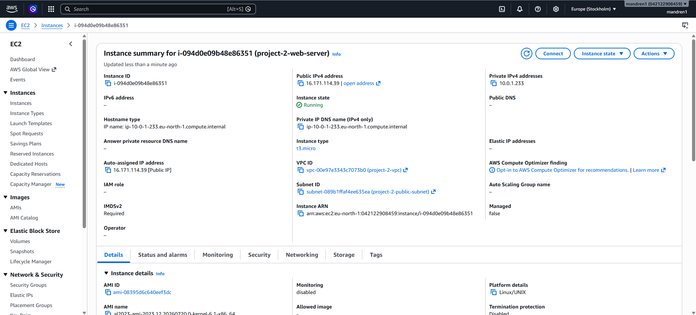
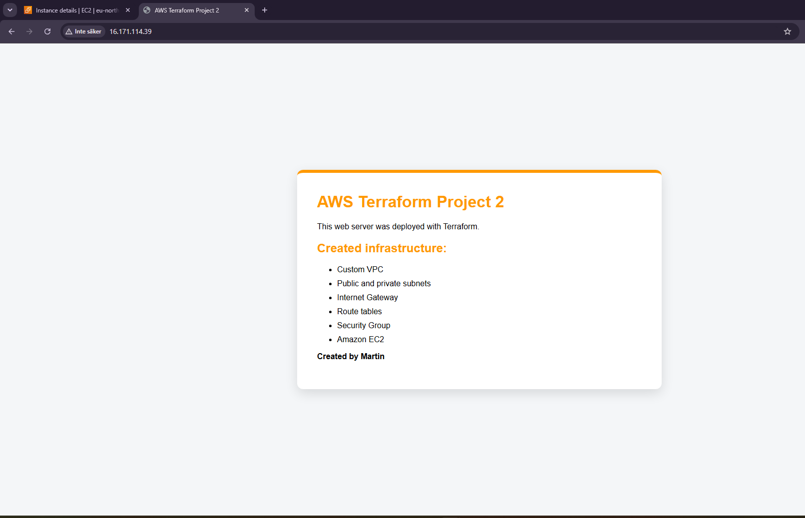

# AWS Cloud Project 2: Custom VPC and Networking

This project builds on Project 1 by introducing custom AWS networking and a more structured Terraform configuration.

The infrastructure is deployed inside a custom VPC containing both a public and a private subnet. An Internet Gateway and Route Table provide internet connectivity to the public subnet, where an Amazon EC2 instance automatically deploys an Apache web server using Terraform User Data.

## Infrastructure

- Custom VPC
- Public subnet
- Private subnet
- Internet Gateway
- Public Route Table
- Route Table Association
- Security Group
- Amazon EC2
- Apache HTTP Server
- Amazon Linux 2023
- Terraform variables and outputs

## Technologies Used

- Terraform
- AWS VPC
- Amazon EC2
- AWS Security Groups
- Internet Gateway
- Route Tables
- Apache HTTP Server
- Amazon Linux 2023

## Key Takeaway

The purpose of this project was to improve my understanding of AWS networking and how VPCs, subnets, Internet Gateways, and Route Tables work together.

Compared to Project 1, I introduced Terraform variables and outputs to make the infrastructure configuration more reusable and easier to maintain.

This project was intentionally kept simple and focused on networking fundamentals. The infrastructure is deployed within a single Availability Zone, as high availability was not the objective of this project. The next project will build on these concepts with a more advanced AWS architecture.

## Screenshots

The following screenshots show the deployed AWS infrastructure and the running web server.

### VPC Resource Map

### Public Route Table

### Public Subnet

### Private Subnet

### EC2 Web Server

### Running Website
