## Project 3: AWS Web Application with high availability.

This project demonstrates the deployment of a highly available and scalable web infrastructure on AWS using Terraform.

## Architecture:

The infrastructure is deployed within a custom VPC across two Availability Zones in "eu-north-1".
Internet traffic enters through the Application Load Balancer, which distributes requests across EC2 instances managed by an Auto Scaling Group.
The EC2 instances communicate with the PostgreSQL database hosted in private subnets. Database credentials are retrieved securely from AWS Secrets Manager through an IAM role.

The infrastructure consists of:
- A custom VPC spanning two Availability Zones
- Two public subnets for the web tier
- Two private subnets for the database tier
- An Application Load Balancer
- An Auto Scaling Group managing EC2 instances
- Amazon RDS PostgreSQL
- AWS Secrets Manager for secure database credential storage
- IAM roles for EC2
- AWS Systems Manager Session Manager for instance access
- Security Groups controlling communication between resources  
- Dynamic Auto Scaling based on CPU utilization
- An Internet Gateway for public connectivity
- A Target Group for routing traffic to healthy EC2 instances

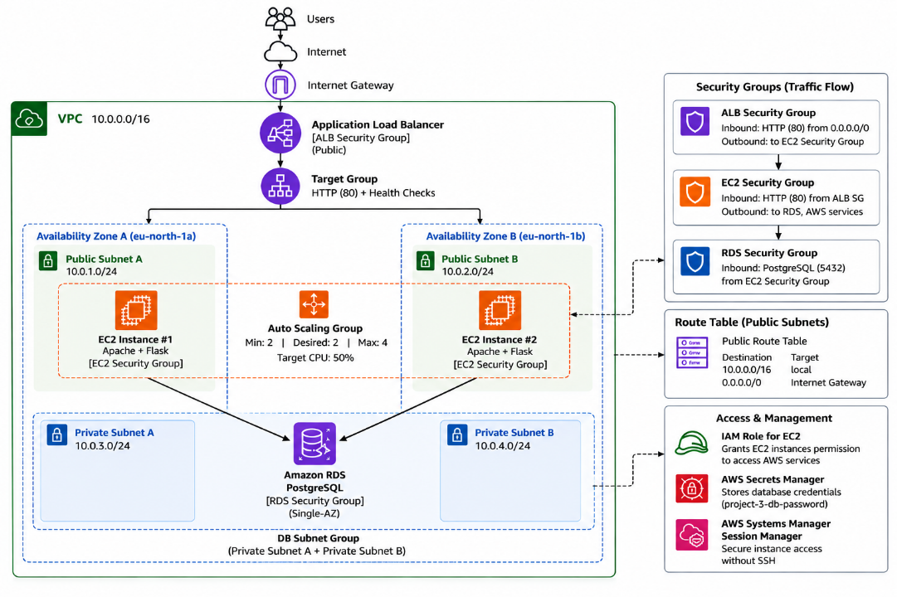

## Auto Scaling:

The Auto Scaling Group is configured with:

- Minimum capacity: 2
- Desired capacity: 2
- Maximum capacity: 4
- Target tracking based on average CPU utilization
- Target CPU utilization: 50%

This allows the infrastructure to automatically adjust the number of EC2 instances based on demand.

## Security:

The architecture follows a layered security approach:

- The ALB accepts HTTP traffic from the internet.
- EC2 instances accept web traffic from the ALB Security Group.
- RDS accepts PostgreSQL traffic only from the EC2 Security Group.
- RDS is deployed using a DB Subnet Group containing private subnets across two Availability Zones.
- The database password is provided to Terraform through a local environment variable.
- Terraform stores the database password in AWS Secrets Manager, where it can be securely retrieved by the EC2 instances.
- EC2 accesses AWS services through an IAM role.
- AWS Systems Manager allows instance management without exposing SSH access.

## Launch Template Flow

The Auto Scaling Group uses an EC2 Launch Template to automatically configure newly launched instances.

    Auto Scaling Group
            ↓
    Launch Template
            ↓
    EC2 Instance
            ↓
    User Data
            ↓
    Install Apache + Python
            ↓
    Deploy Flask Application
            ↓
    IAM Role -> Secrets Manager
            ↓
    Connect to RDS PostgreSQL
            ↓
    Start Services
            ↓
    Target Group Health Check
            ↓
    Receive ALB Traffic

When a new EC2 instance is launched, the following process takes place:

1. The Auto Scaling Group launches an EC2 instance using the Launch Template.
2. The configured User Data script is executed automatically.
3. Apache, Python, pip, and the required Python packages are installed.
4. The Flask application is deployed.
5. The EC2 instance uses its IAM role to retrieve the database credentials from AWS Secrets Manager.
6. The Flask application connects to Amazon RDS PostgreSQL.
7. Flask and Apache are started automatically.
8. The instance is registered with the Target Group.
9. After passing the health check, the instance begins receiving traffic from the Application Load Balancer.

## Screenshots:

### Load Balancing Verification: The same Application Load Balancer distributes requests between different EC2 instances.
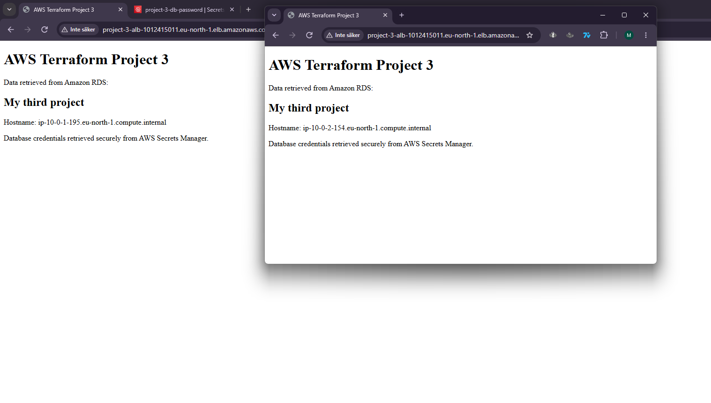

### Target Group: Contains healthy EC2 instances distributed across two Availability Zones.
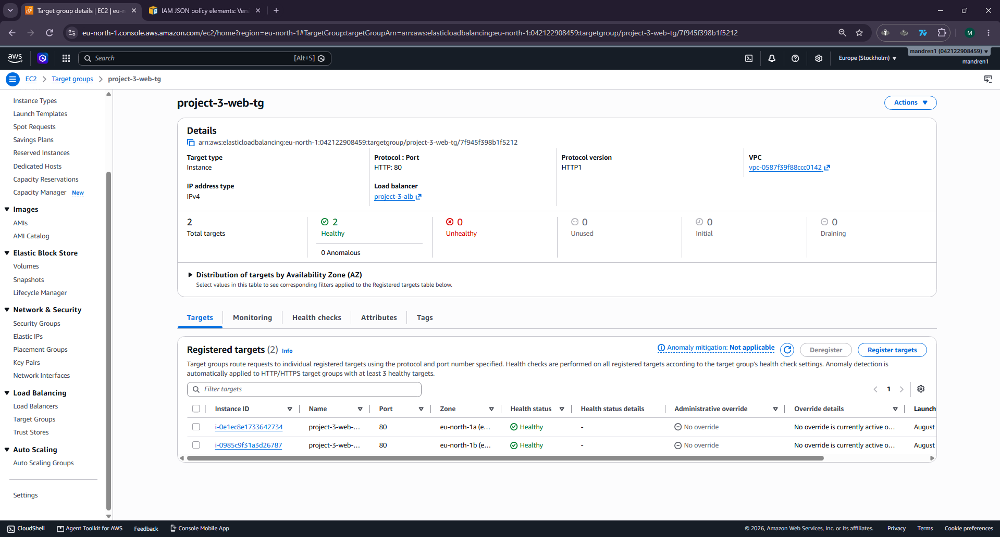

### Auto Scaling Group: Maintains the desired EC2 capacity across the two Availability Zones.
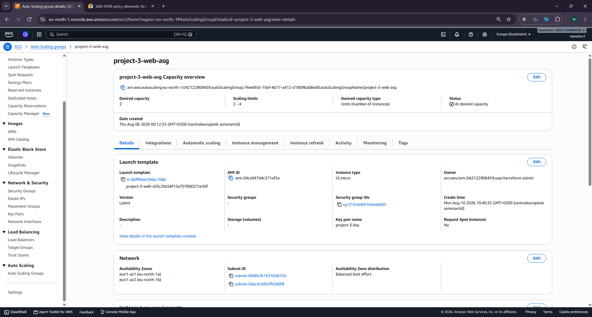

### Auto Scaling Group Policy: The target tracking policy automatically adjusts capacity based on average CPU utilization.
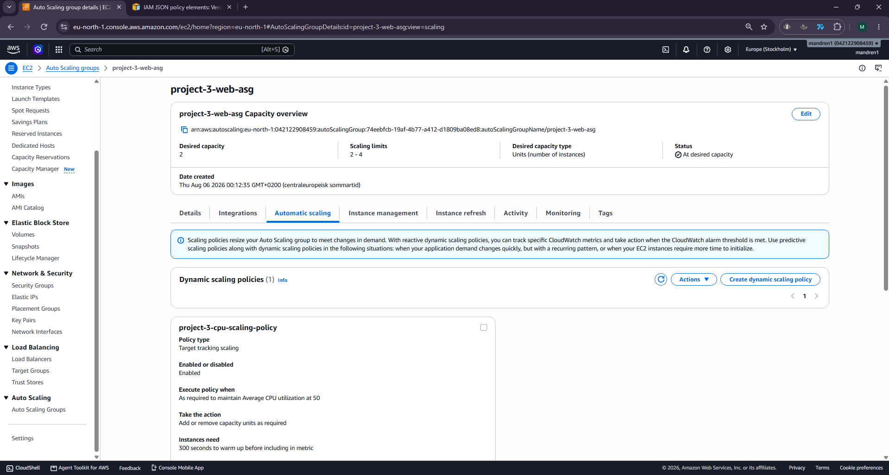

### VPC and Subnets: The VPC contains two public and two private subnets distributed across `eu-north-1a` and `eu-north-1b`.
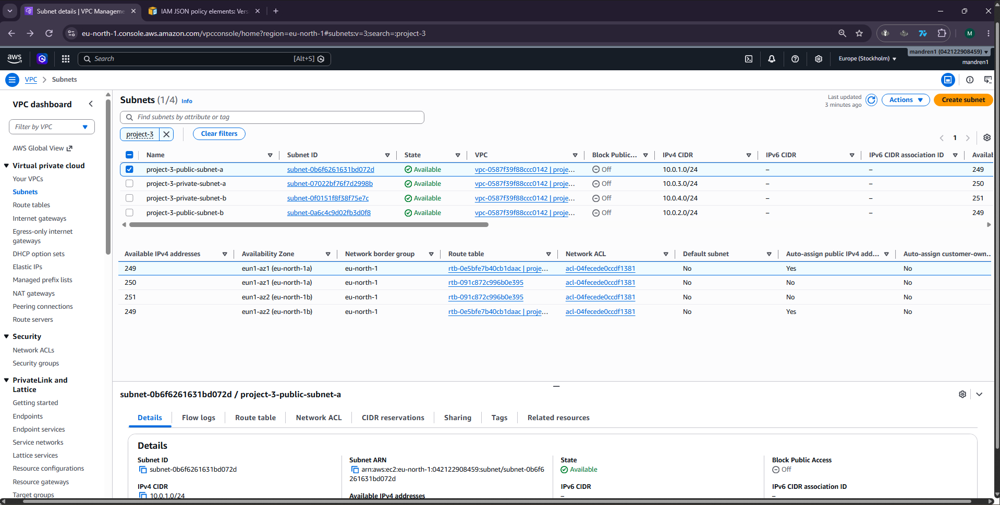

### RDS Database: The application uses an Amazon RDS PostgreSQL database.
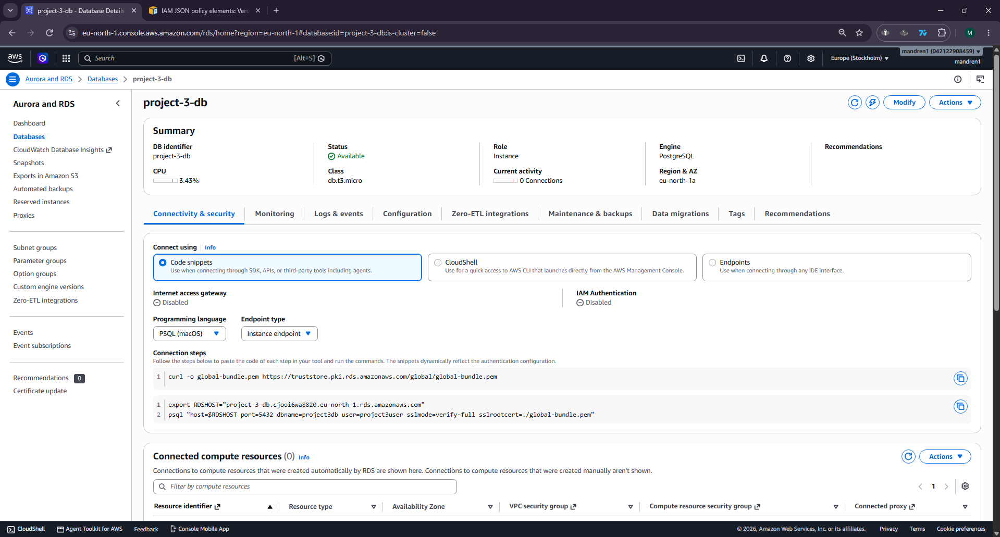

### RDS Subnet Group: The RDS DB Subnet Group contains private subnets across both Availability Zones.
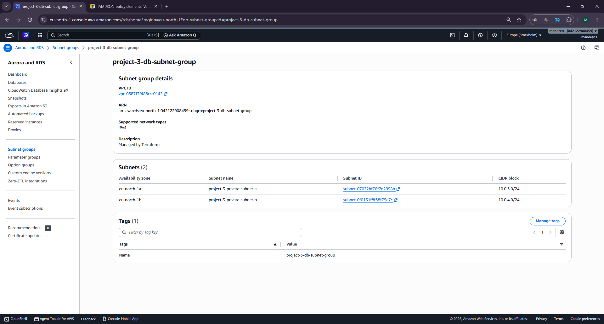

### EC2 IAM Role: EC2 instances use an IAM role to access required AWS services without storing AWS access keys on the instances.
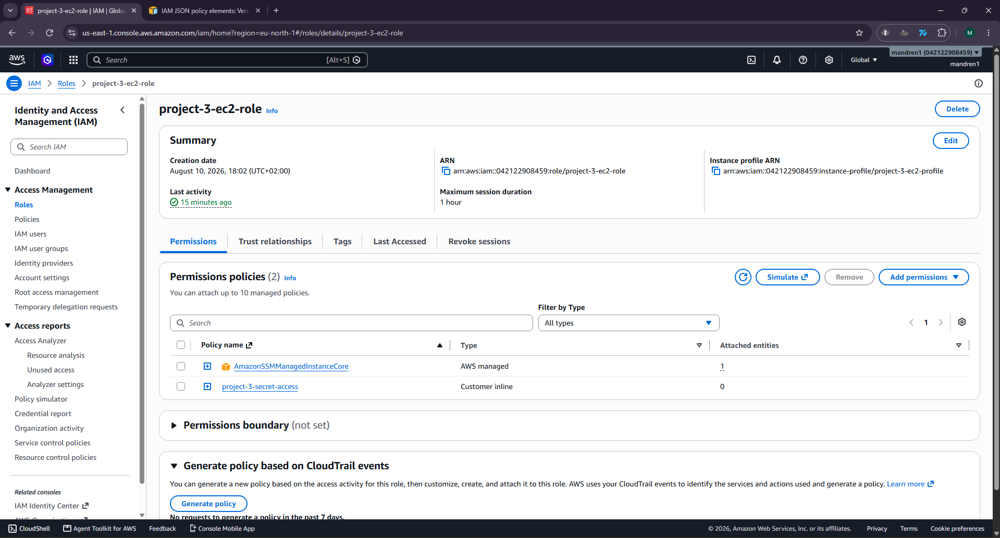

### Secrets Manager: Database credentials are stored in AWS Secrets Manager instead of being hardcoded in the application.
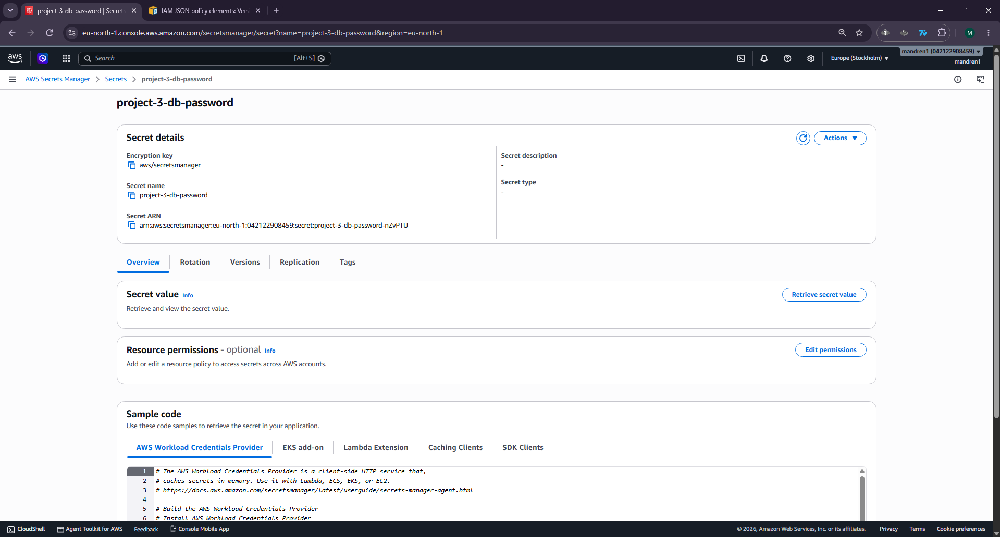

### Session Manager: Is used to securely access and manage the EC2 instances without direct SSH access.
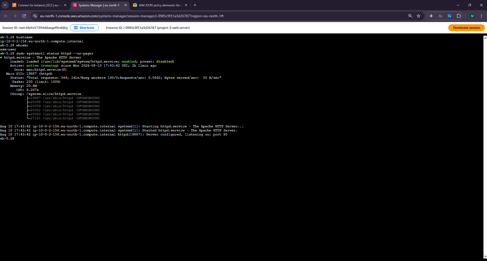

## Infrastructure summary:

| Component                 | Purpose                                     |
| ------------------------- | ------------------------------------------- |
| VPC                       | Provides an isolated AWS network            |
| Public Subnets            | Host internet-facing infrastructure         |
| Private Subnets           | Host the RDS database                       |
| Internet Gateway          | Provides internet connectivity              |
| Application Load Balancer | Distributes incoming HTTP traffic           |
| Target Group              | Routes ALB traffic to healthy EC2 instances |
| Auto Scaling Group        | Maintains and scales EC2 capacity           |
| EC2                       | Hosts the Apache and Flask web applications |
| Amazon RDS                | PostgreSQL relational database              |
| Secrets Manager           | Securely stores database credentials        |
| IAM Role                  | Allows EC2 to access required AWS services  |
| Systems Manager           | Provides secure EC2 management              |
| Security Groups           | Control network access between resources    |

## Technologies Used:

- Terraform
- AWS VPC
- Amazon EC2
- Elastic Load Balancing
- EC2 Auto Scaling
- Amazon RDS PostgreSQL
- AWS Secrets Manager
- AWS IAM
- AWS Systems Manager
- Apache HTTP Server
- Flask
- Python

## Future improvements and lessons learned: 

There are still several improvements I would make if I continued developing the project.

- RDS Multi-AZ: Replace the current Single-AZ RDS deployment with a Multi-AZ configuration to improve database availability and resilience. However, Single-AZ was used for this project to keep the infrastructure costs lower.
- Terraform Code Reusability: Terraform locals could be used for repeated values such as the "project-3" naming prefix, reducing duplication and improving maintainability.
- Private EC2 Subnets: Move the EC2 instances from public to private subnets, allowing only the Application Load Balancer to be directly internet-facing.
- HTTPS with AWS Certificate Manager: Add an HTTPS listener to the ALB and use an ACM certificate to encrypt incoming traffic.
- Remote Terraform State: Store the Terraform state remotely in Amazon S3 with state locking instead of relying on local state.
- Monitoring and Logging: Expand the use of Amazon CloudWatch for application logs, infrastructure monitoring, alarms, and operational visibility.

Overall, I am satisfied with the final architecture. This project gave me a better understanding of how multiple AWS services work together more deeply. In particular, I gained more hands-on experience with Auto Scaling, RDS, IAM roles, Secrets Manager, and communication between resources through Security Groups.
